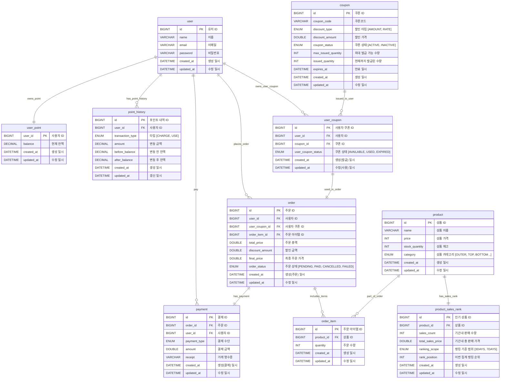

## ERD(Entity Relationship Diagram)

---

## 엔티티 관계 정리

#### 1. user <-> user_point (1:1)
사용자는 하나의 포인트 계좌를 가진다.

#### 2. user <-> point_history (1:N)
사용자는 여러 개의 포인트 거래 내역을 가질 수 있다.

#### 3. user <-> payment (1:N)
사용자는 여러 개의 결제 정보를 가질 수 있다.

#### 4. user <-> order (1:N)
사용자는 여러 개의 주문을 생성할 수 있다.

#### 5. user <-> user_coupon (1:N)
사용자는 여러 개의 쿠폰을 발급받을 수 있다.

#### 6. coupon <-> user_coupon (1:N)
하나의 쿠폰은 여러 사용자에게 발급될 수 있다.

#### 7. user_coupon <-> order (1:1)
하나의 사용자 쿠폰은 하나의 주문에만 사용될 수 있다.  
주문당 하나의 쿠폰만 적용 가능하며, 쿠폰은 한 번 사용되면 더 이상 사용할 수 없다.

#### 8. order <-> order_item (1:N)
하나의 주문은 여러 개의 주문 아이템을 포함할 수 있다.

#### 9. order <-> payment (1:1)
하나의 주문에는 하나의 결제만 매핑된다.

#### 10. product <-> order_item (1:N)
하나의 상품은 여러 주문 아이템에 포함될 수 있다.

#### 11. product <-> product_sales_rank (1:1)
하나의 상품은 하나의 판매 랭킹 정보를 가진다.  
인기 상품 조회 시, 랭킹 정보와 함께 상품 정보를 조회하기 위해 1:1로 연결된다.
