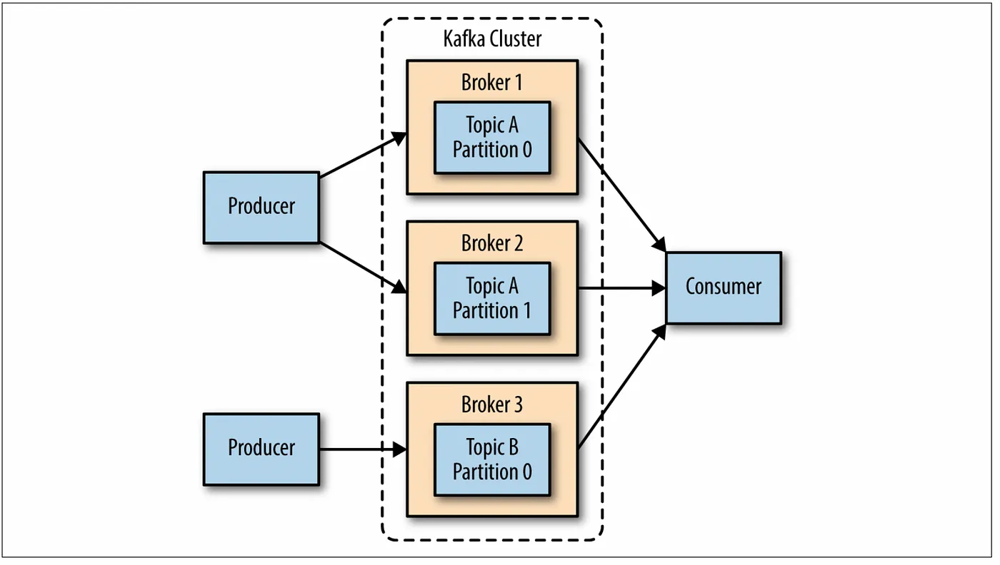
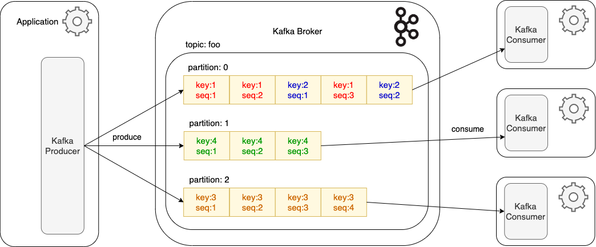

# Apache Kafka (핵심) 개념 정리

##  1. 카프카 탄생 배경
(2010년) LinkedIn 에서는 “데이터를 언제, 어떻게, 얼마나 안전하게 전달할 것인가?”라는 과제에 직면했다. 기존 선택지로는 관계형 DB와 전통적 메시지 큐(MQ)가 있었지만, 대규모 실시간 트래픽 환경에서는 한계가 뚜렷했다.

**전통적 RDBMS (동기 트랜잭션)**
- **동기 처리**로 강한 정합성(ACID) 보장
- 행 단위 **락(낙관·비관)** 으로 충돌 제어
- 수평 확장이 난해해 TPS·IO 한계 및 인프라 비용 급증
- **처리 성능**: 단일 인스턴스 ≈ 3 천 ~ 2 만 TPS

**전통적 MQ (비동기 큐)**
- 서비스 간 **비동기 메시지** 전달 → 느슨한 결합
- 다중 컨슈머 지원 하지만 **브로커 장애 시 유실 위험**
- 대용량 수집 시 **Throughput 병목** 발생 가능
- 처리 성능: 단일 브로커 ≈ 5 만 ~ 10 만 TPS

다음과 같은 이유로 나오게된게!! =>
**Apache Kafka**
- **분산 메시징/스트리밍 플랫폼** — 대규모 실시간 데이터 파이프라인용
- 파티션 + 복제 구조로 **높은 처리량·고가용성·유연성** 확보
- 로그(토픽) **보존**으로 **재시도/재처리** 및 정확-한-번(Exactly-once) 패턴 구현
- 처리 성능: SSD 단일 브로커 ≈ 50 만 TPS, 브로커 추가 시 선형 확장

이를 아래처럼 예시로 정리해보았다.
```markdown
📮 1. 등기우편 (전통적 방식 / 동기 호출)
- 우체국 아저씨는 직접 사람에게 전달해야한다.
- 사람이 없으면 전달 불가, 재시도하거나 실패.
- 즉, 보내는 쪽과 받는 쪽이 동시에 있어야 처리가 되는 구조이다.

✅ 신뢰성은 있지만, 속도 느리고 유연성이 부족함
❌ 받는 사람이 없으면 멈춤


📦 2. 일반 택배 (기존 MQ)
- 택배 아저씨는 문 앞에 두고 가거나, 운 좋으면 바로 전달한다.
- 내가 없어도 물건은 놓고 감 → 비동기 처리 !
- 근데 누가 가져갔는지, 잘 받았는지 추적 어려움 (확인 어려움, 유실 가능)

✅ 빠르긴 한데, 확실하지 않음
❌ 장애나 오류 발생 시 데이터 유실 가능성

🗃️ 3. 보관함 택배 (Kafka)
- 택배 아저씨는 물건을 보관함(Kafka)에 넣어둡니다.
- 나는 원할 때 꺼내서 확인하면 됩니다 (consumer가 pull 방식으로 읽음)
- 보관함엔 기록이 남고, 여러 명이 순서대로 꺼내볼 수도 있습니다.

✅️ 빠르고, 안정적이고, 추적 가능
✅ 내가 안 받아도 안 사라짐 (데이터 유실 거의 없음)
✅️ 여러 사람이 나눠서 받아도 됨 (consumer group)
❌ 보관함 관리 잘 안 하면 쌓이기만 함 → 관리 필요

결론)
기존 방식은 “동기적·즉시성”
MQ는 “비동기적이지만 일회성”
Kafka는 “비동기적 + 기록 중심 + 소비자 주도”
```

## 2. 카프카 아키텍처 

<div align="center">
  
  
</div>

### 2‑1. 주요 용어
- **Broker**: Kafka 서버 프로세스가 구동 중인 노드. 토픽을 파티션 단위로 저장·복제하며 자동 리더 선출과 복제본 운영으로 **고가용성**을 제공한다.  
- **Topic**: 프로듀서와 컨슈머가 메시지를 주고받는 논리적 채널 이름. 메시지를 카테고리별로 묶는 단위이며, 하나의 토픽은 다수의 파티션을 가진다.  
- **Partition**: 토픽을 물리적으로 분할한 단위. 파티션 내부에서는 메시지 **순서(오프셋)** 가 보장되고, 파티션 수만큼 병렬 읽기·쓰기가 가능하다.  
- **Producer**: 애플리케이션에서 발생한 레코드를 특정 토픽/파티션으로 전송하는 클라이언트. **Fire-and-forget**, **Sync**, **Async+Callback** 세 가지 전송 패턴을 지원하며, 키-해싱으로 파티션을 결정한다.  
- **Consumer**: 브로커로부터 레코드를 *pull* 방식으로 가져와 비즈니스 로직을 수행하는 클라이언트. 같은 **Consumer Group** 내에서 파티션을 분할 소비하며, 오프셋 커밋으로 **At-least-once** 또는 **Exactly-once** 처리를 구현한다.  
- **Consumer Group**: 여러 컨슈머 인스턴스가 하나의 논리적 그룹을 형성해 파티션을 분할 소비하는 단위. 파티션당 최대 한 컨슈머가 할당돼 중복 소비를 방지하고, 컨슈머 수 조절로 확장성을 확보한다.  

### 2‑2. 데이터 흐름


1. **Application → Kafka Producer**  
   - 애플리케이션이 생성한 키(key)·값(value) 레코드를 프로듀서가 수신해 전송 준비를 합니다.

2. **Producer → Kafka Broker(Topic / Partition)**  
   - 프로듀서는 키 해시(Hash)로 파티션을 결정하고, 레코드를 디스크에 **순차 Append** 합니다.

3. **Kafka Broker**  
   - 브로커는 파티션 로그를 저장하며, 복제(Replication)로 고가용성을 확보합니다.

4. **Broker → Consumer Group**  
   - 같은 Consumer Group 내 컨슈머 인스턴스들이 파티션을 분담해 *pull* 방식으로 레코드를 가져옵니다.

5. **Offset Commit**  
   - 컨슈머가 처리(consume)를 완료하면 오프셋을 커밋해 재시작·장애 복구 시 정확히 이어서 처리하도록 합니다.

> 동일 Key는 항상 같은 파티션에 기록되어 **키 단위 순서**가 보장됩니다.  
> 컨슈머 인스턴스를 늘리면 파티션 수만큼 **선형적으로 처리량**이 확장됩니다.

## 3. Consumer Lag

### 3‑1. 정의
**Consumer Lag** = `Latest Offset` − `Committed Offset`  
컨슈머가 아직 처리하지 못한 메시지 수(지연 정도).

### 3‑2. 왜 중요할까?
- **실시간성 지표**: Lag↑ → 소비 속도가 생산 속도를 따라가지 못함
- **장애 감지**: 네트워크 문제·컨슈머 다운 시 즉시 Lag 급증
- **용량 계획**: 지속적 Lag 우상향 → 컨슈머 증설·로직 최적화 필요

### 3‑3. 정상 vs 비정상 패턴
| 패턴 | 상태 | 대응 |
| ---- | ---- | ---- |
| 0 ~ 수건에서 안정 | 정상 | — |
| 급등 후 0으로 복귀 | 일시 장애·배치 소비 | 원인 확인 후 무시 |
| 지속적 우상향 | 처리 속도 < 생산 속도 | 컨슈머 확장·코드 최적화 |
| 톱니형 급등·급락 반복 | 예외 재시도 루프 | 재시도 횟수·DLQ 설정 |

### 3‑4. 모니터링 & 알림
- **Prometheus + Grafana**: `kafka_consumer_records_lag_max` 시각화
- **Spring Actuator**: `KafkaConsumerMetrics` 활용
- **Alert 예시**: Lag > 1 k 메시지 또는 지연 > 30 s → Slack/PagerDuty 알림

> **트랜잭션(쿠폰 발급, 주문 확정)** 컨슈머는 Lag 0 ~ 수 ms 유지가 목표!  
> **배치 적재** 컨슈머는 일정 시간 내 Lag을 0으로 되돌리는 것이 목표!
