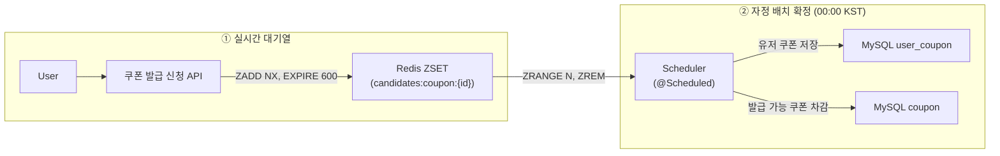
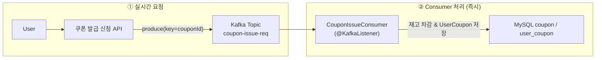

# Apache Kafka 적용

##  선착순 쿠폰 발급

### 1. 변경 전 (Redis 기반)
> ZADD NX으로 중복 신청 차단하고, score = time로 신청 순서 보장하며, 10 분 내 확정함으로써 메모리·폭주 트래픽 최소화한다.  
> 대규모로 들어오는 선착순 쿠폰이라 이정도로 설정해도 많이 몰릴 것으로 판단하여 TTL을 10분으로 설정하였다.

### 2. 변경 후 (Kafka 기반)

> Redis 대기열을 **Kafka Topic `coupon-issue-req`** 로 교체한다.  
> • 순서 보장(키=`couponId`) • 내구성 • Consumer 수평 확장 • TTL 불필요

#### 핵심 변화
1. **ZSET + Scheduler 제거** → 메시지 발행 직후 Consumer 가 실시간 처리  
2. **Kafka 파티셔닝**  
   *  같은 `couponId` 는 동일 파티션에 기록되어 **재고 race condition 없음**   
3. **모니터링/리플레이**  
   *  Topic 로그 그대로 보존 ⇒ 장애 시 특정 offset 부터 재처리 가능

#### 결론
| 항목 | Redis 방식 | Kafka 방식 |
|------|-----------|-----------|
| 순서 보장 | ZSET `score=time` | 파티션 단일 리더 |
| 대량 유입 내구성 | 메모리 기반, TTL 필요 | 디스크 로그, Retention 정책 |
| 수평 확장 | Scheduler 단일 인스턴스 | Consumer Group 로드밸런싱 |
| 리플레이/분석 | 수동 백업 필요 | offset 이동으로 즉시 가능 |
