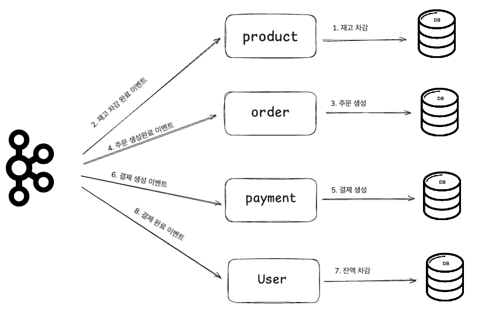
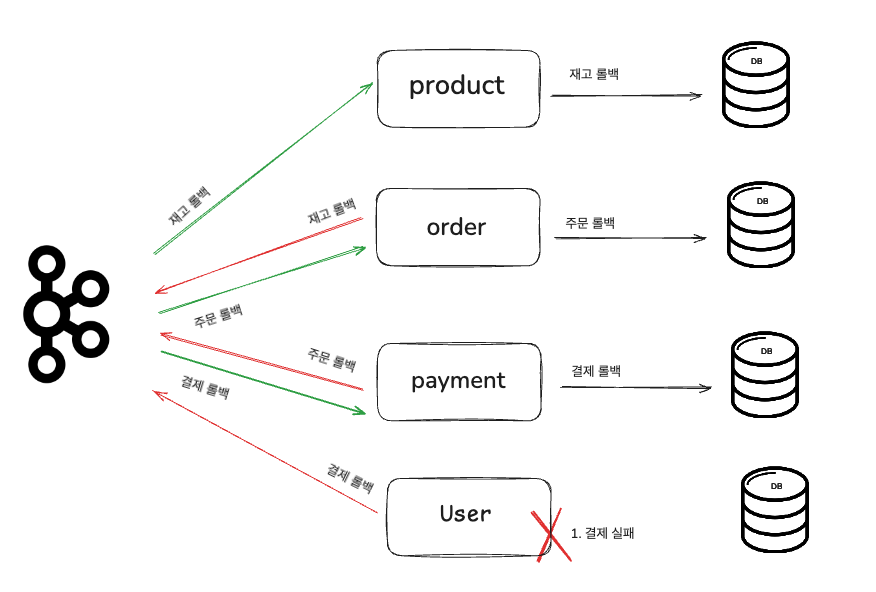

<!-- TOC -->
- [1. 배경](#1-배경)
- [2. 문제](#2-문제)
  - [2.1 도메인별 책임](#21-도메인별-책임)
  - [2.2 도메인 간 상호작용 흐름과 트랜잭션 경계](#22-도메인-간-상호작용-흐름과-트랜잭션-경계)
    - [2.2.1 도메인 간 흐름](#221-도메인-간-흐름)
  - [2.3 도메인 분리에 따른 트랜잭션 처리의 한계](#23-도메인-분리에-따른-트랜잭션-처리의-한계)
  - [2.4 해결방안 제시](#24-해결방안-제시)
    - 2.4.1 Saga 패턴(Choreography)으로 원자성 보존
    - 2.4.2 API Gateway Orchestrator로 UX 일관성 유지
    - 2.4.3 Eventual Consistency & Outbox/Inbox로 정합성 확보
    - 2.4.4 Idempotency Key로 중복 요청 방지
  - [2.5 실패 보상 전략 비교](#25-실패-보상-전략-비교)
- [3. 결론](#3-결론)
  - [3.1 OrderService / PaymentService 분리](#31-orderservice--paymentservice-분리)
<!-- /TOC -->

# 모놀리식 주문 시스템의 마이크로서비스 전환 설계 보고서

## 1. 배경
현재 우리 시스템은 모든 기능이 하나의 애플리케이션에 통합된 모놀리식 아키텍처로 구성되어 있습니다. 서비스 초기에는 개발과 배포가 간단하고 관리가 용이했지만, 서비스 규모가 커짐에 따라 복잡도가 증가하고 트래픽이 급증하면서 구조적 한계가 드러나고 있습니다.
사소한 기능 수정에도 전체 시스템을 빌드하고 재배포해야 하며, 이로 인해 배포 주기가 길어지고 오류 발생 시 전체 서비스에 영향을 줄 수 있습니다. 또한 특정 도메인에 부하가 집중되더라도 전체 시스템을 확장해야 하므로 자원 사용이 비효율적입니다.

업무 도메인 간의 강한 결합은 유지보수성을 떨어뜨리고 개발 속도를 저해하고 있으며, 장애 발생 시 시스템 전체로 전파되는 위험성도 큽니다. 이러한 문제들은 운영 효율성을 저하시킬 뿐만 아니라, 빠르게 변화하는 비즈니스 요구에 유연하게 대응하기 어렵게 만듭니다.

이에 따라 서비스의 안정성과 확장성, 개발 민첩성을 확보하기 위해 마이크로서비스 아키텍처(MSA)로의 전환이 필요합니다. MSA는 각 도메인을 독립적인 서비스로 분리하여 운영함으로써 구조적 유연성과 기술적 민첩성을 확보할 수 있는 현실적인 대안입니다.

## 2. 문제
현재 OrderFacade에서 주문/결제 처리 로직은 하나의 트랜잭션 내에서 여러 도메인의 기능을 수행하고 있습니다. 이러한 단일 트랜잭션 방식은 동시성 이슈, 병목 현상, 배포의 어려움, 특정 기능의 장애가 전체 시스템에 미치는 영향 등의 문제를 야기할 수 있습니다.

### 현재 주문 처리 로직

```java
@Transactional
public OrderResult order(OrderCriteria.Create criteria) {
  // product 재고 감소
  // order 생성, 쿠폰 적용
  // pay 결제 생성
  // 잔액 차감
  // 주문 확정
  // 외부 데이터 플랫폼 전송
  // 상품 판매 기록 저장  
}
```
이를 해결하기 위해 주문 도메인을 중심으로 마이크로서비스를 분리하고, 분리된 환경에서의 트랜잭션 처리 방안을 모색합니다.

### 2.1 도메인별 책임
위 주문 로직을 분석을 통해 핵심 도메인들을 책임을 나눌 수 있습니다.

- **User (사용자)**: 사용자 정보, 잔액 관리(충전/차감)
- **Product (상품)**: 상품 정보 관리, 재고 관리
- **Order (주문)**: 주문 생성, 주문 항목 관리, 쿠폰 적용, 주문 확정
- **Payment (결제)**: 결제 처리, 외부 PG 연동

### 2.2 도메인 간 상호작용 흐름과 트랜잭션 경계

#### 2.2.1 도메인 간 흐름
앞서 정리한 4개 도메인(User, Product, Order, Payment)은 주문/결제 처리 과정에서
다음과 같은 **단계적/연쇄적 호출**을 수행합니다.

1. **재고 확인 및 차감**  
   Order → Product
   재고 부족 시 즉시 실패 반환

2. **주문 레코드 생성**  
   Order ←→ Coupon (선택)  
   주문 번호·쿠폰 할인액 확정

3. **결제 요청**  
   Order → Payment (외부 PG 연동)  

4. **잔액(포인트) 차감**  
   Order → User  
   차감 실패 시 결제 취소 필요

> 현재 모놀리식 구조에서는 위 1-4단계를 **단일 DB 트랜잭션**으로 묶어
> ACID 특성을 보장하지만, 서비스 분리 후에는 **각 도메인이 독립 DB**를
> 갖기 때문에 동일한 방식으로 롤백 및 커밋을 맞추기 어렵습니다.

이처럼 **단일 트랜잭션 경계가 도메인 분리에 맞지 않는다는 사실**이
분산 트랜잭션 문제(2.3 절)의 핵심 원인이 됩니다.

### 2.3 도메인 분리에 따른 트랜잭션 처리의 한계

1) 원자성(Atomicity) 붕괴

모놀리식 구조라면 주문·재고·결제를 하나의 트랜잭션으로 묶어 “전부 성공하거나 전부 실패”를 보장할 수 있습니다. 그러나 서비스마다 DB가 갈라지면 그 보증이 사라집니다. 주문 DB에서는 COMMIT이 일어났는데 결제 DB에서는 ROLLBACK이 발생할 수 있는 식이죠. 결국 “한 번에 모두 뒤집는” 안전망이 없으니, 서비스 간 상태 불일치를 다룰 별도 메커니즘이 필요합니다.

2) 일관성(Consistency) 흔들림

서비스 간 통신은 네트워크를 경유합니다. 메시지가 도착하는 순서가 뒤바뀌거나 지연되면, 짧은 순간이더라도 데이터가 서로 다른 값을 가질 수 있습니다. 예를 들어 재고는 이미 차감됐는데, 결제 서비스가 실패를 반환해 버리면 사용자는 “재고는 빠졌는데 주문은 없다”는 모순 상태를 보게 됩니다. 결국 ‘즉시 일관성’ 대신 ‘결국 일관성(eventual consistency)’ 모델로 사고를 전환해야 합니다.

3) 2-Phase Commit(2PC)의 현실적 한계

각 DB에 XA-Transaction을 걸어 2PC로 전역 트랜잭션을 흉내 낼 수도 있지만, 준비(Prepare) 단계에서 모든 자원이 락에 묶입니다. 트래픽이 몰리면 지연(latency)이 치솟고, 한 노드만 장애가 나도 전체 트랜잭션이 멈춰 버립니다. 운영 환경에서는 “성능 저하·규모 확장 어려움·장애 전파”라는 삼중고가 따라오기 때문에 사실상 선택지에서 배제되는 경우가 많습니다.

4) 네트워크 장애가 곧 메시지 유실·중복

서비스 간 이벤트를 비동기로 주고받다 보면, 네트워크 단절이나 브로커 장애가 발생할 수 있습니다. 송신자는 “제대로 전송됐는지”를 확신할 수 없어 한 번 더 보내고, 수신자는 중복 이벤트를 받을 수도 있습니다. 반대로 완전히 잃어버린 메시지도 생깁니다. 결국 멱등성(idempotency) 과 재시도·DLQ(Dead-Letter Queue) 전략이 기본 탑재돼야 합니다.

5) 보상 트랜잭션의 폭발적 증가

단일 트랜잭션 대신 Saga 패턴을 쓰면 단계별로 ‘로컬 트랜잭션 + 이벤트’만 처리하고, 실패 시엔 이미 끝난 단계를 거꾸로 복구(보상)해야 합니다. 주문이 취소되면 “재고를 되돌리고 → 쿠폰 상태를 복원하고 → 결제 승인을 취소”하는 식이죠. 서비스·기능이 많아질수록 경우의 수가 기하급수적으로 늘어나며, 각 단계의 보상 로직과 예외 처리를 정교하게 설계·테스트해야 합니다.

---

### 2.4 해결방안 제시
분산 트랜잭션으로 인한 원자성·정합성·장애 전파 문제를 완화하기 위해 아래 4가지 해결 방안을 설계합니다.

#### 2.4.1 Saga 패턴(Choreography)으로 원자성 보존

**정상적인 분산 트랜잭션 프로세스**


(1) Product 서비스: 재고 검증 후 재고 차감하여 DB 적재  
(2) Kafka에 재고 차감 완료 이벤트 발행    
(3) Order 서비스: 재고 차감 완료 이벤트를 구독해서 주문 생성 후 DB 적재  
(4) Kafka에 주문 생성 완료 이벤트 발행  
(5) Payment 서비스: 주문 생성 완료 이벤트를 구독해서 결제 생성 후 DB 적재  
(6) Kafka에 결제 생성 이벤트 발행  
(7) User 서비스: 결제 생성 이벤트를 구독해서 재고 차감 후 DB 적재  
(8) Kafka에 결제 완료 이벤트 발행

**실패 분산 트랜잭션 프로세스**

(1) User 서비스에서 잔액 부족으로 트랜잭션 실패  
(2) User 서비스에서 결제 롤백 이벤트 발행  
(3) Payment에서 결제 롤백 이벤트 구독해서 해당 결제 취소  
(4) Payment에서 주문 롤백 이벤트 발행  
(5) Order에서 주문 롤백 이벤트를 구독해서 해당 주문 취소  
(6) Order에서 재고 롤백 이벤트 발행  
(7) Product에서 주문 롤백 이벤트 발행  
(8) Product에서 주문 롤백 이벤트를 구독해서 해당 상품 재고 복구  

#### 2.4.2 API Gateway Orchestrator로 UX 일관성 유지

```java
Client ─▶ Gateway ─▶ Order-Orchestrator
           │          ├─ OrderService:생성
           │          ├─ ProductService:재고차감
           │          ├─ PaymentService:결제
           │          └─ UserService:잔액차감
           └───────────◀────────────── aggregated response
```
*▲ API Gateway + Orchestrator 컴포넌트 다이어그램 (예시)*

*Orchestrator가 전체 흐름·보상 호출을 캡슐화하므로*

클라이언트는 **단일·일관된 응답**만 받아 UX 혼선을 최소화합니다.


*각 서비스는 “성공 시 다음 단계 호출, 실패 시 보상 트랜잭션 실행” 원칙으로 설계합니다.*

#### 2.4.3 Eventual Consistency & Outbox/Inbox로 정합성 확보

1. **주문생성됨** 이벤트 → ProductService 재고 감소
2. **결제완료됨** 이벤트 → UserService 잔액 차감
3. 실패 이벤트는 DLQ로 보내고 재처리/알람

```sql
-- Outbox 패턴 예시 테이블
CREATE TABLE order_outbox (
  id            BIGINT AUTO_INCREMENT PRIMARY KEY,
  aggregate_id  BIGINT NOT NULL,
  event_type    VARCHAR(50) NOT NULL,
  payload       JSON        NOT NULL,
  status        VARCHAR(20) DEFAULT 'PENDING',
  created_at    TIMESTAMP   DEFAULT CURRENT_TIMESTAMP
);
```
*▲ 트랜잭션 내 이벤트를 안전하게 저장하는 Outbox 예시*

> DLQ (Dead Letter Queue): 지정 횟수 재시도 후에도 실패하면 별도 큐로 격리해 수동/배치 복구  
> **Outbox/Inbox 패턴**: 로컬 트랜잭션 안에서 이벤트를 Outbox 테이블에 기록하고, 별도 프로세스가 이를 브로커로 publish(Inbox 테이블로 consume)함으로써 'DB 기록 = 메시지 발행'의 원자성을 확보합니다.

#### 2.4.4 Idempotency Key로 중복 요청 방지

1. **Client / Gateway**가 Idempotency-Key: <UUID> 헤더 설정
2. 서비스는 키 + 해시값을 Redis 등에 캐시
3. 동일 키로 재요청 시, 기존 결과(결제 승인 번호 등)를 즉시 반환

### 2.5 실패 보상 전략 비교

| **전략** | **개념 요약** | **장점** | **단점** | **적용/고려 사례** |
| --- | --- | --- | --- | --- |
| **이벤트 리스너 기반 보상** | 실패 이벤트를 브로커로 발행, 소비자가 보상 트랜잭션 수행 | 서비스 간 결합도 낮음, DLQ 재활용 | 비동기 → 결과 확정 지연 | OrderFailed → 재고 복구 |
| **동기 주문 취소 API** | 실패 즉시 Orchestrator가 취소/롤백 REST 호출 | 결과 즉시 확정, 디버깅 단순 | 서비스 강결합, 지연·타임아웃 위험 | 결제 실패 → /orders/{id}/cancel |
| **UX 재시도·대체 흐름** | 사용자에게 재시도·대체 선택권 제공 | 시스템 로직 단순 | 사용자 불편·지표 악화 가능 | “다시 결제” 버튼 |
| **보상 쿠폰 발행** | 자동 쿠폰·포인트 지급 | 사용자 만족 즉시 확보 | 재무 비용, 악용 우려 | 재고 품절 → 10% 쿠폰 |
| **SAGA 보상 트랜잭션** | 단계별 보상 정의로 전체 일관성 확보 | 분산 설계·테스트 복잡 | 서비스별 보상 코드 필요 | 재고 ↓ → 결제 → 잔액 → 실패 시 역순 복구 |

## 3. 결론
결론적으로, 모놀리틱 아키텍처에서 MSA로의 전환은 서비스 확장성과 유연성을 확보하기 위한 중요한 선택이며, 이를 통해 상품, 주문, 결제, 사용자 잔액 등 고부하 도메인을 독립적으로 배포하고 확장할 수 있는 기반이 마련됩니다. 그러나 MSA 구조에서는 단일 트랜잭션의 적용이 어려워지면서 분산 트랜잭션 관리의 복잡성이 새롭게 등장합니다.

이에 따라, SAGA 패턴, 이벤트 기반 구조, Idempotency Key, 분산 트레이싱, API Gateway + Orchestrator 구조 등의 적용은 분리된 트랜잭션 간 정합성을 확보하고 시스템 전체의 안정성을 높이는 데 효과적인 해법이 됩니다. 특히 트랜잭션을 분리하는 과정에서는 동기 처리와 비동기 처리의 적절한 구분이 중요하며, 각 상황에 맞는 아키텍처 패턴을 선택하는 것이 핵심입니다.

궁극적으로 MSA 환경에서 안정적인 서비스를 구현하기 위해서는 서비스 간의 독립성을 유지하면서도 전체적인 데이터 일관성을 보장할 수 있도록 아키텍처를 정교하게 설계해야 합니다. 이러한 기반 위에서 시스템은 확장성, 장애 격리, 배포 효율성, 트랜잭션 안정성 측면에서 큰 개선을 이룰 수 있습니다.

#### 3.1 OrderService / PaymentService 분리

추가적으로 위의 분석 결과, Order 서비스와 Payment 서비스를 분리해야한다고 생각하였습니다.

1. **보안 및 컴플라이언스 대응**  
   결제 도메인은 카드 정보 암호화, PG 인증 등 보안 요건이 많습니다.   
   주문 도메인과 분리하면 민감 정보 접근 범위를 줄여 감사·점검 범위도 작아지고 결제 쪽만 따로 배포/운영이 가능해 패치나 보안 대응도 훨씬 빠르게 할 수 있습니다.
2. **서로 다른 트래픽 특성**  
   주문은 프로모션, 재고 이벤트 등으로 트래픽 급증이 많고, 결제는 카드 인증 지연, 예약결제 등으로 상대적으로 느린 패턴입니다.  
   → 별도 서비스로 분리하고, 각기 다른 스케일링 전략을 쓰는 게 더 효율적입니다.
3. **장애 전파 최소화**  
   PG 연동 문제가 생겨도 주문 서비스는 ‘결제 대기’ 상태로 계속 동작할 수 있어, 전체 장바구니 흐름이 끊기지 않습니다.

**결국, 주문과 결제는 도메인 책임이 다르고, 보안·운영 측면 요구사항도 달라서 하나로 묶기보단 분리하는 게 리스크 관리나 확장성 면에서 더 나은 선택이라고 생각합니다.**


```text
주문 TX() {
  상품 검증();
  상품 재고 차감();
  쿠폰 검증();
  쿠폰 사용();
  주문 정보 저장();
}
```

```text
결제 TX() {
  잔액 차감();
  결제 정보 저장();
  주문 상태 변경();
  주문 정보 데이터플랫폼 전송();
  주문 상품 판매량 기록 저장();
}
```   

