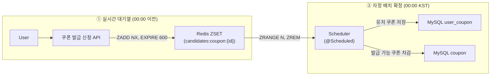

# Redis 기반 선착순 시스템 설계 및 구현 보고서

## 개요
대량 트래픽이 몰려도 공정성을 유지하며 선착순 쿠폰을 발급할 수 있도록 Redis + MySQL 혼합 아키텍처를 설계.

- **실시간성** : 쿠폰 신청 즉시 ZADD NX + EXPIRE 600 s 로 ZSET에 반영해 중복을 차단하고 신청 순서를 보존
- **데이터 정합성** : 매일 00:00 KST 배치가 대기열 상위 N명을 user_coupon에 일괄 INSERT 하면서 coupon 현재 발급 수 업데이트 → 초과 발급 방지
- **운영 효율성** : 10 분 TTL로 좀비 키 자동 정리


## 🟥 Redis 실시간 집계

| 항목     | 설계                             |
|--------|--------------------------------|
| 자료구조   | **Sorted Set(ZSET)**           |
| Key    | `candidates:coupon:{couponId}` |
| Member | `{userId}`                     |
| Score  | epochSecond() 요청시간             |
| TTL    | *600 s (10 분)                  |

> ZADD NX으로 중복 신청 차단하고, score = time로 신청 순서 보장하며, 10 분 내 확정함으로써 메모리·폭주 트래픽 최소화한다.
> 대규모로 들어오는 선착순 쿠폰이라 이정도로 설정해도 많이 몰릴 것으로 판단하여 TTL을 10분으로 설정하였다.

```text
🏛️ 아키텍처
[User] ─► [쿠폰 발급 신청 API] ── ZADD NX (+EXPIRE 600) ──► [Redis ZSET]
```

## 🔵 Database – 배치 확정

| 항목     | 설계                                                            |
|--------|---------------------------------------------------------------|
| 스케줄    | 매일 00:00 KST                                                  |
| 흐름     | 발급가능한 쿠폰 조회 -> 대기열 추출 -> 유저 쿠폰 저장 -> 발급 가능 쿠폰 수량 차감 -> 대기열 정리 |
| 대상     | `user`, `user_coupon`                                         |
| 주요 명령어 | `ZRANGE`, `ZREM`, `DEL`                                       |

> Redis ZSET(대기열)에 쌓인 “선착순 후보”를 하루 한 번(자정) 정산하여 user_coupon 테이블에 확정 발급한다.

```text
🏛️ 배치 아키텍처
[Redis ZSET: candidates:coupon:{id}]
        │ (00:00) ZRANGE + ZREM
        ▼
   [Scheduler] ── Bulk INSERT ──► [MySQL user_coupon]
```

## 전체 흐름 구성도



## 향후 개선 계획

| 카테고리 | 개선 아이디어 | 기대 효과 |
|----------|--------------|-----------|
| **성능** | Lua 스크립트로 `ZADD NX` + `EXPIRE` 원자 처리 | RTT 1회, 경합 시 레이스컨디션 제거 |
| **모니터링** | Redis·배치 메트릭을 Prometheus → Grafana 대시보드 | 발급 성공률·대기열 길이 실시간 확인 |
| **오류 복구** | 배치 실패 시 미처리 userId를 DLQ(ZSET)로 이관 | 손실 없이 재처리 가능 |
| **확장** | Kafka 스트림 기반 실시간 발급(옵션) | 배치 없이 밀리초 단위 확정 가능 |
