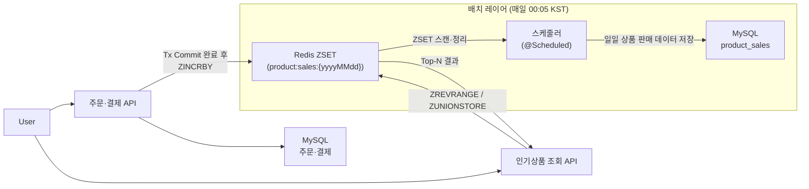

# Redis 기반 인기 상품 랭킹 시스템 설계 및 구현 보고서

## 개요
실시간 주문 데이터를 기반으로 **인기 상품 랭킹**을 빠르게 산출하고,  
장기 분석 지표로 활용하기 위해 **Redis Sorted Set(ZSET) + MySQL**을 혼합한 아키텍처를 설계

- **실시간성**: 주문 발생 즉시 랭킹 반영
- **데이터 정합성**: 매일 새벽 배치로 Redis ↔ DB 간 누락/중복 검증
- **확장성**: TTL·파티셔닝 전략으로 트래픽 증가에 유연 대응

## 🟥 Redis 실시간 집계
| 항목 | 설계                                 |
|------|------------------------------------|
| 자료구조 | **Sorted Set(ZSET)**               |
| Key | `product_sales:popular:{yyyyMMdd}` |
| Member | `product:{productId}`              |
| Score | 누적 판매 수량 (*count*)                 |
| TTL | **31일** – 일/주/월 랭킹 집계용 데이터 보존      |

> 주문‑결제 트랜잭션 커밋 직후 `ZINCRBY` 로 판매 수량을 일자별 ZSET에 누적한다.

```text
🏛️ 아키텍처
[User] ─► [주문 결제] ─► [DB]
        ▲
        └── Tx Commit 완료 후
                    ▼
                [Redis] ──► ZINCRBY product:sales:{yyyyMMdd} {count} product:{productId}
```

## ⏱️ 기간 합산 랭킹 조회

> 특정 기간(start ~ end) 동안의 판매 랭킹을 온디맨드 로 집계해 5분간 캐싱한다.

| 항목    | 내용 |
|-------|------|
| Key   | `product_sales:popular:{start}-{end}:top{N}` |
| 조회 흐름 | 1) `hasKey(rangeKey)`로 5분 캐시 존재 여부 확인<br/>2) 없으면 **일별 ZSET**(존재하는 키만) → `ZUNIONSTORE` 로 합산<br/>3) 결과를 `tmp:{uuid}` → `RENAME rangeKey` 후 `expire 5m` |
| 정렬·추출 | 합산 ZSET에서 `ZREVRANGE 0 N-1 WITHSCORES` |

**TTL이 5분인 이유**: 연속 호출 시 Redis 부하 방지, 재집계 지연 방지, 최신 데이터 반영!!

```text
🏛️ 아키텍처
[User] ---> [인기 상품 조회 API] -- Redis 명령(EXISTS·ZUNIONSTORE·ZREVRANGE) --> [Redis]
   ▲                                                        |
   |                                                        |
   └------------------- 결과 반환 ----------------------------┘
```


## 🔵 Database 일일 집계 저장

| 항목 | 설계                                             |
|------|------------------------------------------------|
| 스케줄 | 매일 00:05 KST                                   |
| 소스 | 전일 ZSET (`product_sales:popular:{yyyyMMdd-1}`) |
| 대상 | `product_sales`                                |
| 보존 | 영구 (분석·조회용)                                    |

> 일자 기준으로 누적 집계된 ZSET을 스케쥴러 배치를 통해 DB에 저장하므로써 Redis와 DB 사이 정합성 보장

```text
🏛️ 아키텍처
[Redis ZSET: product:sales:{yyyyMMdd}]
                │  (매일 00:05, ZSET 스캔·정리)
                ▼
            [Scheduler]     
                │  저장
                ▼
[MySQL 일일 판매 집계 (product_sales_daily)]

```
## 전체 흐름 구성도


## 향후 개선 계획
1. **주간·월간 ZSET 집계 자동화**(`ZUNIONSTORE`)  
2. **Heat Ranking**: 판매량 가중치+노출 가중치 결합
