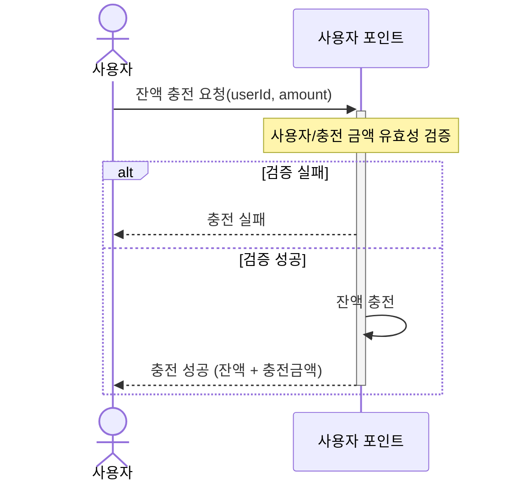
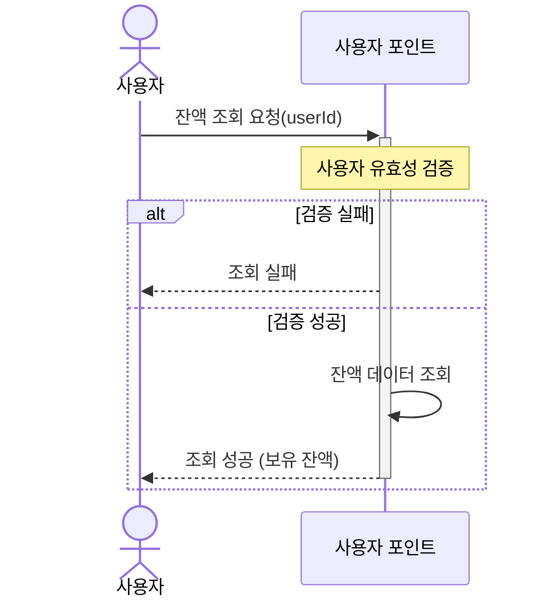
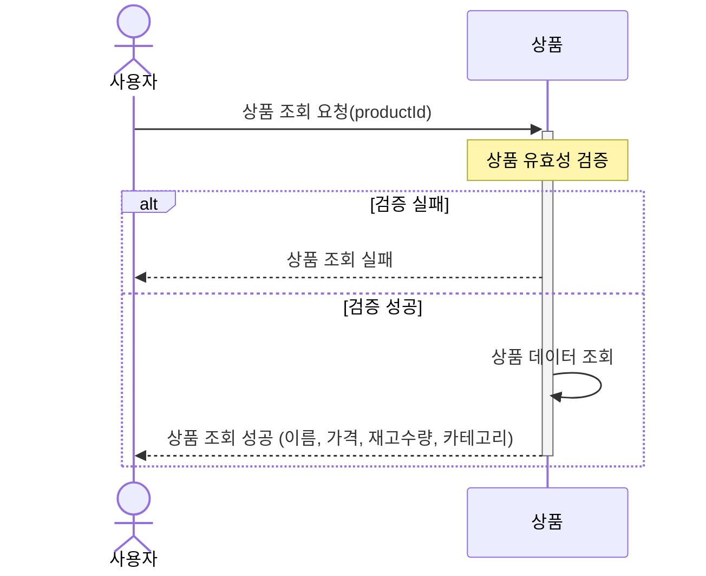
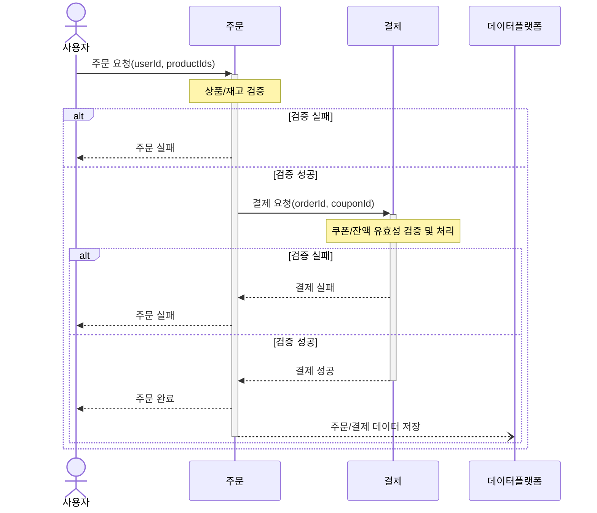
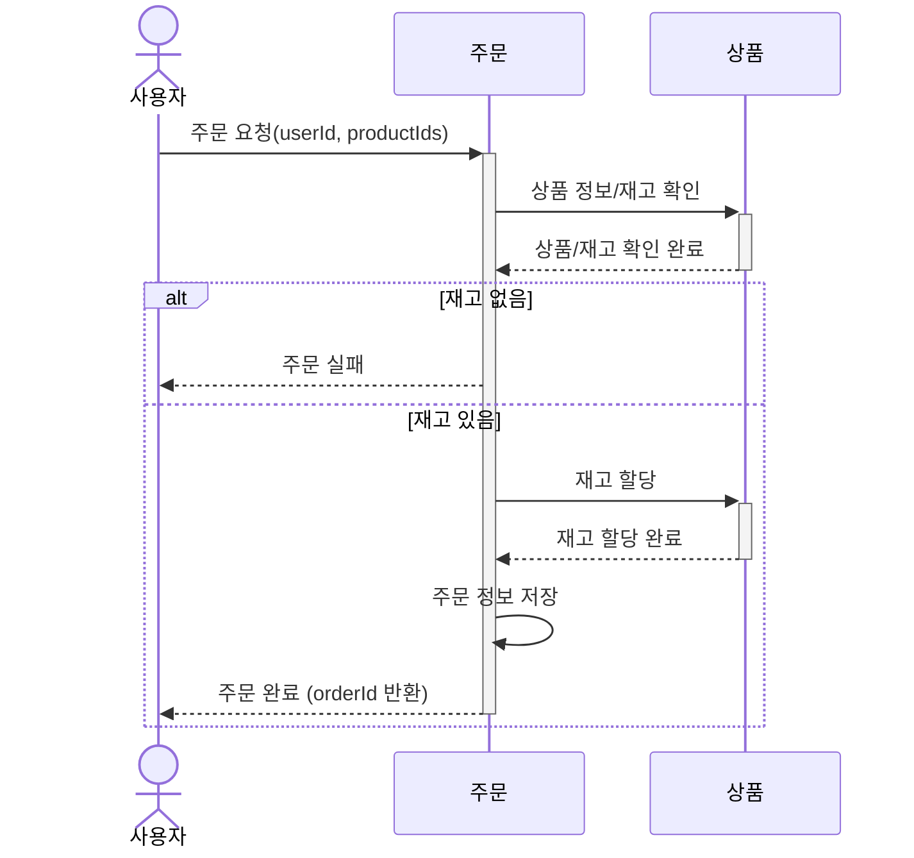
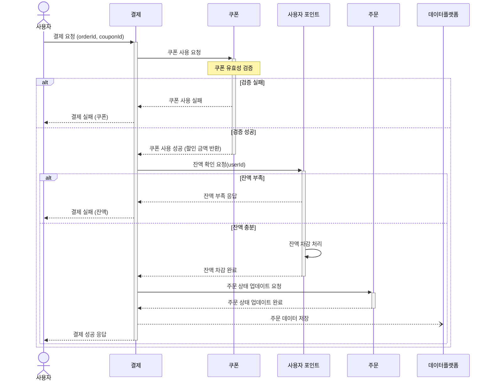
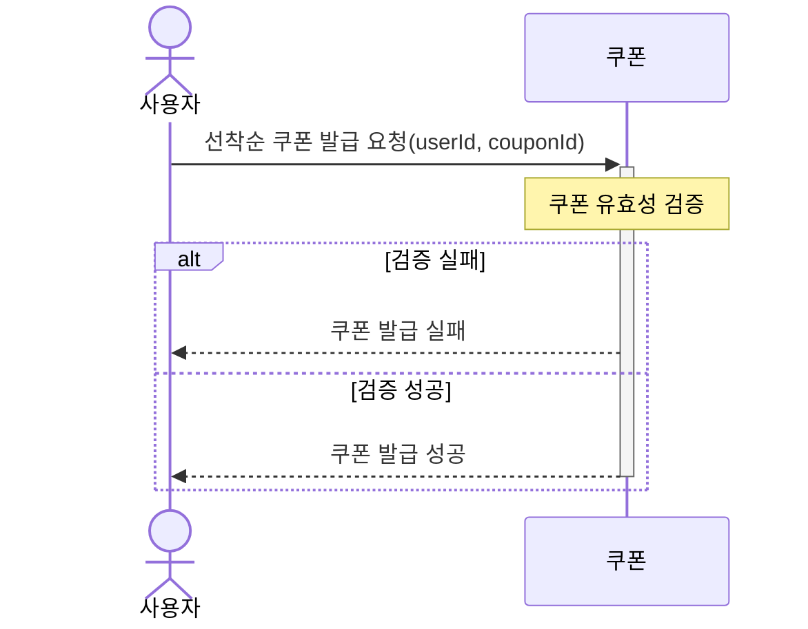
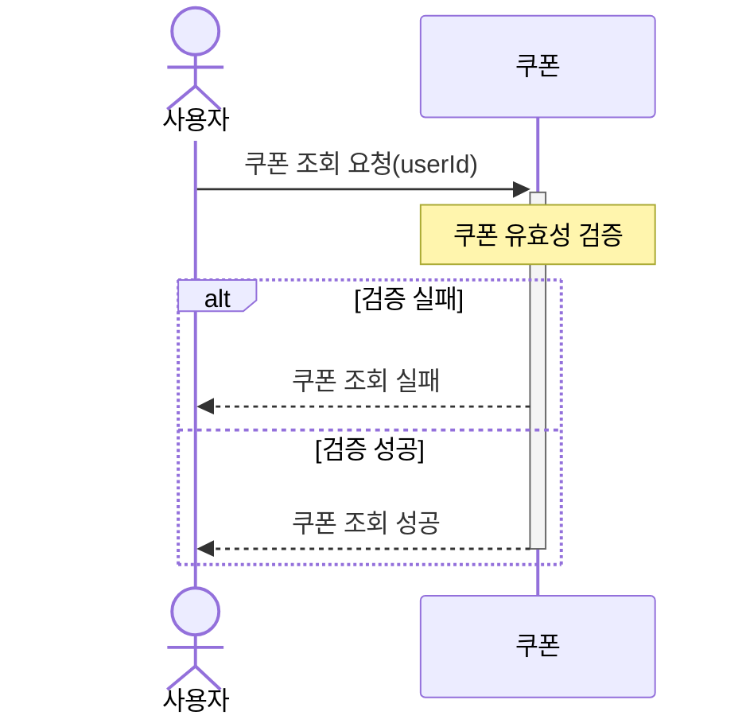
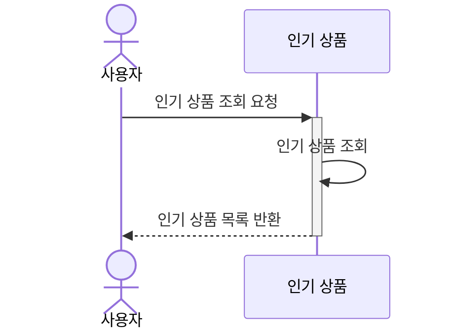
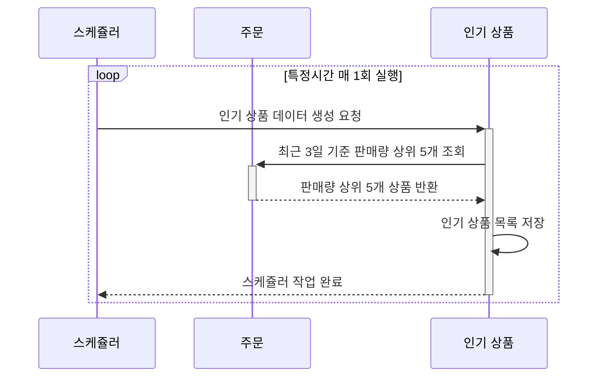

# 시퀀스 다이어그램(Sequence Diagram)

---

- [1. 잔액](#1-잔액)
- [2. 상품](#2-상품)
- [3. 주문/결제](#3-주문결제)
- [4. 선착순 쿠폰](#4-선착순-쿠폰)
- [5. 인기 판매 상품](#5-인기-판매-상품)

## 1. 잔액
### 잔액 충전

### 잔액 조회

## 2. 상품
### 상품 조회

## 3. 주문/결제
### 주문/결제 개요

### 상품 주문 상세

### 상품 결제 상세

## 4. 선착순 쿠폰
### 선착순 쿠폰 발급

### 보유 쿠폰 목록 조회 

## 5. 인기 판매 상품
### 인기 판매 상품 조회

### 인기 판매 상품 생성

