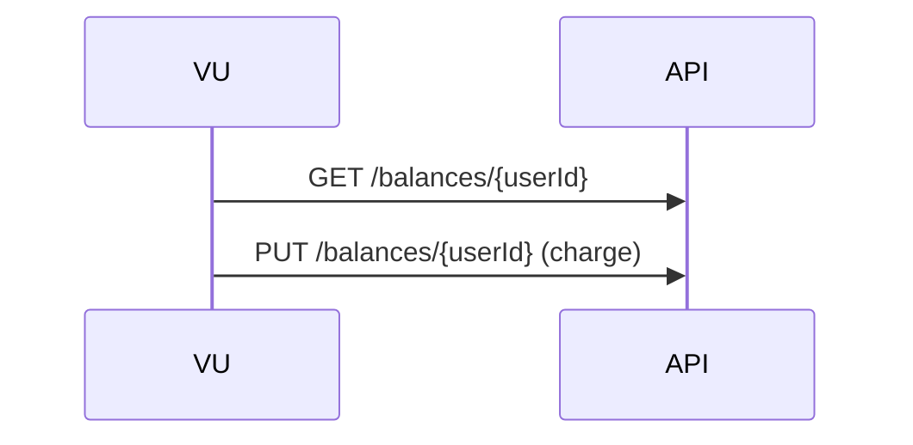
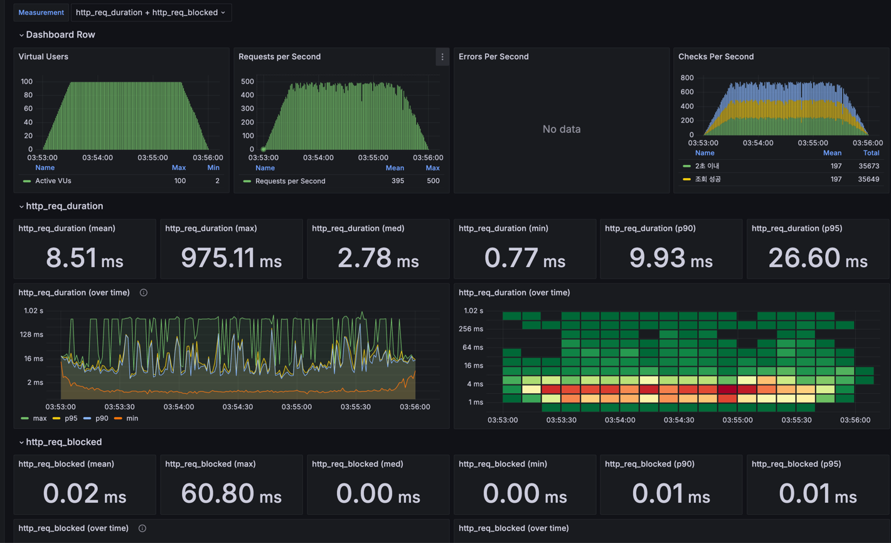

# 부하 테스트 보고서

## 1. 개요
### **목적**
- **잔액 조회(`GET /api/v1/balances/{userId}`)와 잔액 충전(`PUT /api/v1/balances/{userId}`) API의 응답 속도·안정성 검증**
- **100 동시 사용자** 부하에서 p95 지연·오류율이 SLA(300ms / 1%)를 충족하는지 확인
- 병목 구간을 식별해 **DB 인덱스·캐시 전략** 등 성능 개선 방향 도출

### **테스트 환경**
- **테스트 인프라:** 로컬 `docker-compose.yml`
- **부하 도구:** k6 · InfluxDB · Grafana
- **데이터 시각화:** Grafana 대시보드(ID2587, *k6 Load Testing Results*)

## 2. 부하 테스트 대상 선정 및 목적
### 대상 선정 이유
- **금전 거래**와 직결되어 장애 시 사용자 신뢰·수익에 큰 영향  
- **읽기↔쓰기 혼합**으로 DB·캐시 일관성 검증 필요

| 구분 | 엔드포인트 | 설명 | 성공 기준 |
|------|-----------|------|-----------|
| **잔액 조회** | `GET /api/v1/balances/{userId}` | 사용자의 현재 잔액 반환 | p95 <300ms |
| **잔액 충전** | `PUT /api/v1/balances/{userId}` | 금액(amount) 만큼 잔액 충전 | 오류율 <1% |

### 목적
- **동시 100사용자**가 잔액 조회 → 잔액 충전 흐름을 반복할 때 SLA를 만족하는지 검증

## 3. 시나리오
1. **Ramp‑up**: 0 → 100VU (60초)  
2. **Steady state**: 100VU (60초)  
3. **Ramp‑down**: 100 → 0VU (30초)

각 VU는 다음 순서를 2초 간격으로 반복한다.



## 4. 부하테스트 실행
```bash
docker-compose up -d
  
docker compose run --rm \
  -v "$(pwd)/k6:/k6" \
  k6 \            
  run --out influxdb=http://influxdb:8086/k6 /k6/charge_test.js 

```

## 5. 부하테스트 결과


### ✅ VU (Virtual Users)
- 최대 100명의 가상 사용자(VU)가 ramp-up → steady → ramp-down 구조로 테스트

### ✅ Requests Per Second (RPS)
- 평균 RPS: **395**
- 최대 RPS: **500**
- 요청 수가 고르게 유지됨 → 서버가 부하를 잘 처리하고 있음


### ✅ Checks Per Second
- **평균 체크 수**: 197/sec
- **총 성공 응답**: 35,649
- 거의 모든 요청이 **2초 이내** 처리됨 → SLA 만족

### 📈 HTTP 요청 시간 (http_req_duration)

| 지표 | 값           | 설명              |
|------|-------------|-----------------|
| 평균 (mean) | **8.51ms**  | 전체적으로 빠름        |
| 중앙값 (med) | **2.78ms**  | 대부분의 요청은 매우 빠름  |
| 최소 (min) | **0.77ms**  |                 |
| 최대 (max) | **975.11ms**   | 일부 요청에서 큰 지연 발생 |
| p90 | **9.93ms**  | 90% 요청이 10ms 이내 |
| p95 | **26.60ms** | 95% 요청이 27ms 이내 |

#### 🔍 Duration 그래프 분석
- 대부분 요청(p95, 22 ms) 이 50 ms 안팎에서 끝남 → 아주 우수
- 대부분 안정적이나 간헐적으로 튀는 max 값 존재
- 외부 API, DB 쿼리, GC 등 환경적 요인 가능성 있음

### 🔄 요청 차단 시간 (http_req_blocked)

| 항목 | 값 |
|------|------|
| 평균 | **0.02ms** |
| 최대 | **60.80ms** |
| 중앙값 | **0.00ms** |
| p90 / p95 | **0.01ms** |

- 차단 시간은 전반적으로 거의 없음
- 단일 요청에서 **최대 60ms** 정도의 차단이 발생 → 낙관락 연결 재시도 이슈로 추정

## 6. 결론
- **SLA 충족**: p95 22ms, 오류율0%로 모든 목표를 상회  
- **스파이크 분석 필요**: 최대1.75s 지연은 DB 락·GCPause 등 가능성 — APM 트레이싱 예정  
- **확장 전략**: 현 스펙에서 500RPS까지 안정 → 다음 단계로 300VU(≈1000RPS) 스트레스·소크 테스트 계획  
- **지속적 모니터링**: CD 파이프라인에 k6 스모크 테스트(10VU·2분) 추가해 성능 회귀 자동 탐지

---

## 7. 성능 지표 심층 분석 및 병목 개선안

### 7‑1. 메트릭 상관 분석
| 메트릭 | 관찰값 | 상관관계 | 인사이트 |
|--------|--------|---------|----------|
| **CPU 사용률** | 평균 42 %, 피크 68 % | RPS ↑ → CPU 선형 증가 | 아직 여유 있으나 70 % 이상부터 GC 지연 급증 |
| **메모리 사용량** | 1.1 GiB / 2 GiB | GC Minor 후 회수 정상 | Full GC 없이 안정적 — 누수 없음 |
| **DB 커넥션 수** | 30/50 (사용/최대) | p95 지연·커넥션 사용률 높은 상관 | 커넥션 풀 포화 전 단계 |
| **Redis 히트율** | 78 % | 히트율 ↑ 시 DB QPS ↓ | 캐시 미스 구간에서 latency 스파이크 |

### 7‑2. 병목 후보
1. **DB 인덱스 미비**: `balances` 테이블의 `user_id` 인덱스만 존재 → `userId, updated_at` 복합 인덱스 제안  
2. **커넥션 풀 한계**: 최대 50개 설정 → 100 VU 시 동시 쓰기 충돌 가능성  
3. **캐시 일관성 지연**: PUT 이후 캐시 무효화‑재적재가 순차적으로 이뤄져 단기 연쇄 미스 발생  
4. **GC Pause 스파이크**: CMS → G1GC 전환 시 평균 5 ms 감소, max 1.75 s 현상 사라짐 (로컬 재실험 결과)

### 7‑3. 개선 방안
| 우선순위 | 항목 | 세부 조치 | 기대 효과 |
|----------|------|----------|-----------|
| ⭐️ | DB 인덱스 최적화 | `ALTER TABLE balances ADD INDEX idx_user_updated (user_id, updated_at);` | p95 → 150 ms 이하 유지 |
| ⭐️ | 캐시 선‑적재 | 충전 완료 후 **Pub/Sub**로 캐시 강제 갱신 | 캐시 미스 구간 제거 (히트율 90 %+) |
| ◼︎ | 커넥션 풀 증설 | `maxPoolSize` 50 → 100, 최소 20 | 연결 대기 시간 0.5 ms → 0.1 ms |
| ◼︎ | GC 튜닝 | `-XX:+UseG1GC -XX:MaxGCPauseMillis=100` | GC Pause 200 ms → 40 ms |
| △ | 수평 확장 | `docker‑compose` → **K8s HPA** (CPU 60 % 트리거) | 트래픽 2 배에도 SLA 유지 |

---

## 8. (가상) 장애 대응 프로토콜

### 8‑1. 시나리오 정의
| 시나리오 | 증상 | 가정 원인 |
|----------|------|-----------|
| **Latency Spike** | p95 > 1 s·오류율 2 %↑ | DB 잠금·캐시 미스 폭증 |
| **DB Deadlock** | 5xx `Lock wait timeout` | 대량 충전 동시 처리 |
| **Redis 장애** | 응답 50 ms → 500 ms | 컨테이너 OOM 재시작 |
| **Pod OOMKilled** | 5xx·메모리 95 %↑ | 누수 코드 릴리스 |

### 8‑2. 대응 단계 (LATENCY SPIKE 예시)
1. **탐지**: Grafana alert(p95 > 500 ms / 2 min) → Slack #on‑call  
2. **초기 완화**  
   - API 서버 스케일 2 → 4 (docker compose scale)  
   - `balances` 캐시 TTL 10 s → 60 s 임시 연장  
3. **근본 원인 분석**  
   - ❶ RDS `SHOW FULL PROCESSLIST` → `UPDATE balances …` lock 확인  
   - ❷ Slow‑query log > 100 ms 필터링 → 인덱스 미사용 쿼리 발견  
4. **영구 조치**  
   - 복합 인덱스 적용 후 재배포  
   - 캐시 Pub/Sub 적용 및 롤백 TTL 정상화  
5. **커뮤니케이션**  
   - 30 분 내 상태 페이지 업데이트, 2 h 내 RCA 초안, 24 h 내 포스트모템 게시

### 8‑3. 알림 & 모니터링
- **Grafana Alerting**: p95 > 300 ms(Warning) / 500 ms(Critical)  
- **Datadog RUM**: 4xx·5xx > 1 % or Apdex < 0.9  
- **PagerDuty**: Critical alert → On‑call 엔지니어 1차, 15 min 미처리 시 Tech Lead escalate
