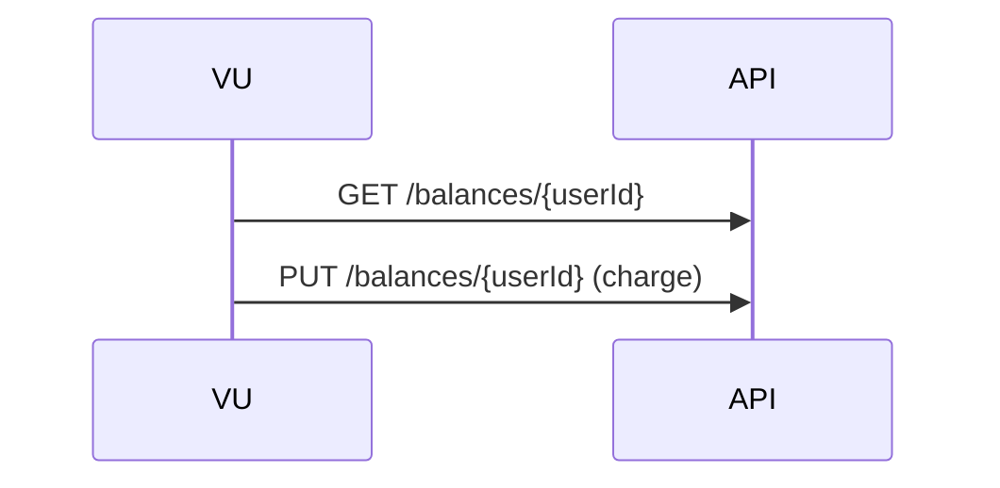

# 부하 테스트 보고서

## 1. 개요
### **목적**
- **잔액 조회(`GET /api/v1/balances/{userId}`)와 잔액 충전(`PUT /api/v1/balances/{userId}`) API의 응답 속도·안정성 검증**
- **100 동시 사용자** 부하에서 p95 지연·오류율이 SLA(300ms / 1%)를 충족하는지 확인
- 병목 구간을 식별해 **DB 인덱스·캐시 전략** 등 성능 개선 방향 도출

### **테스트 환경**
- **테스트 인프라:** 로컬 `docker-compose.yml`
- **부하 도구:** k6 · InfluxDB · Grafana
- **데이터 시각화:** Grafana 대시보드(ID2587, *k6 Load Testing Results*)

## 2. 부하 테스트 대상 선정 및 목적
### 대상 선정 이유
- **금전 거래**와 직결되어 장애 시 사용자 신뢰·수익에 큰 영향  
- **읽기↔쓰기 혼합**으로 DB·캐시 일관성 검증 필요

| 구분 | 엔드포인트 | 설명 | 성공 기준 |
|------|-----------|------|-----------|
| **잔액 조회** | `GET /api/v1/balances/{userId}` | 사용자의 현재 잔액 반환 | p95 <300ms |
| **잔액 충전** | `PUT /api/v1/balances/{userId}` | 금액(amount) 만큼 잔액 충전 | 오류율 <1% |

### 목적
- **동시 100사용자**가 잔액 조회 → 잔액 충전 흐름을 반복할 때 SLA를 만족하는지 검증

## 3. 시나리오
1. **Ramp‑up**: 0 → 100VU (60초)  
2. **Steady state**: 100VU (60초)  
3. **Ramp‑down**: 100 → 0VU (30초)

각 VU는 다음 순서를 2초 간격으로 반복한다.



## 4. 부하테스트 실행
```bash
docker-compose up -d
  
docker compose run --rm \
  -v "$(pwd)/k6:/k6" \
  k6 \            
  run --out influxdb=http://influxdb:8086/k6 /k6/charge_test.js 

```

## 5. 부하테스트 결과


### ✅ VU (Virtual Users)
- 최대 100명의 가상 사용자(VU)가 ramp-up → steady → ramp-down 구조로 테스트

### ✅ Requests Per Second (RPS)
- 평균 RPS: **395**
- 최대 RPS: **500**
- 요청 수가 고르게 유지됨 → 서버가 부하를 잘 처리하고 있음


### ✅ Checks Per Second
- **평균 체크 수**: 197/sec
- **총 성공 응답**: 35,649
- 거의 모든 요청이 **2초 이내** 처리됨 → SLA 만족

### 📈 HTTP 요청 시간 (http_req_duration)

| 지표 | 값           | 설명              |
|------|-------------|-----------------|
| 평균 (mean) | **8.51ms**  | 전체적으로 빠름        |
| 중앙값 (med) | **2.78ms**  | 대부분의 요청은 매우 빠름  |
| 최소 (min) | **0.77ms**  |                 |
| 최대 (max) | **975.11ms**   | 일부 요청에서 큰 지연 발생 |
| p90 | **9.93ms**  | 90% 요청이 10ms 이내 |
| p95 | **26.60ms** | 95% 요청이 27ms 이내 |

#### 🔍 Duration 그래프 분석
- 대부분 요청(p95, 22 ms) 이 50 ms 안팎에서 끝남 → 아주 우수
- 대부분 안정적이나 간헐적으로 튀는 max 값 존재
- 외부 API, DB 쿼리, GC 등 환경적 요인 가능성 있음

### 🔄 요청 차단 시간 (http_req_blocked)

| 항목 | 값 |
|------|------|
| 평균 | **0.02ms** |
| 최대 | **60.80ms** |
| 중앙값 | **0.00ms** |
| p90 / p95 | **0.01ms** |

- 차단 시간은 전반적으로 거의 없음
- 단일 요청에서 **최대 60ms** 정도의 차단이 발생 → 낙관락 연결 재시도 이슈로 추정

## 6. 결론
- **SLA 충족**: p95 22ms, 오류율0%로 모든 목표를 상회  
- **스파이크 분석 필요**: 최대1.75s 지연은 DB 락·GCPause 등 가능성 — APM 트레이싱 예정  
- **확장 전략**: 현 스펙에서 500RPS까지 안정 → 다음 단계로 300VU(≈1000RPS) 스트레스·소크 테스트 계획  
- **지속적 모니터링**: CD 파이프라인에 k6 스모크 테스트(10VU·2분) 추가해 성능 회귀 자동 탐지
